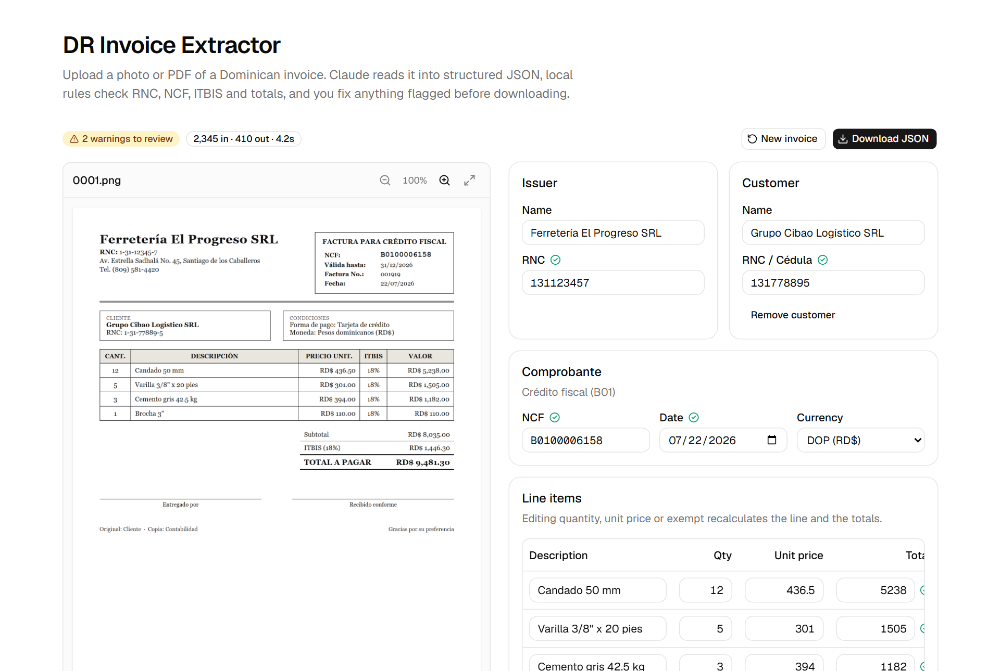
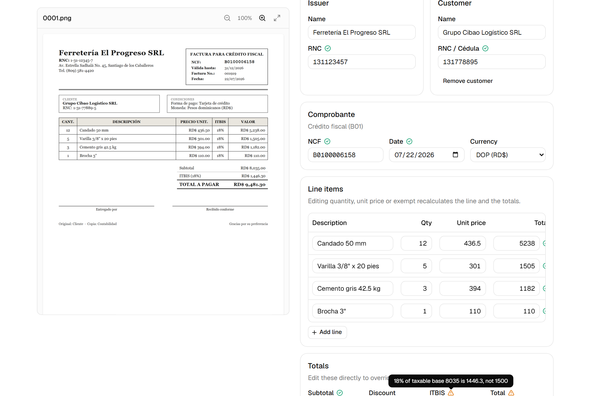
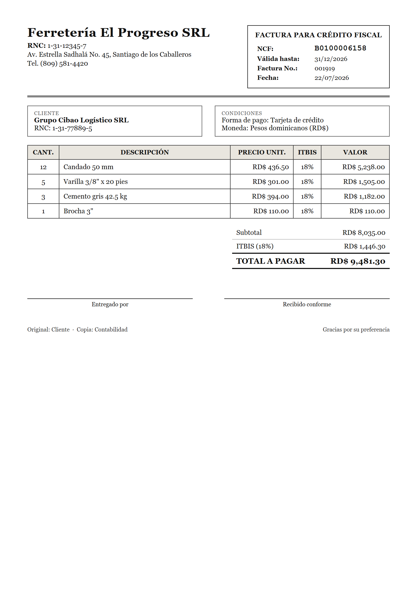
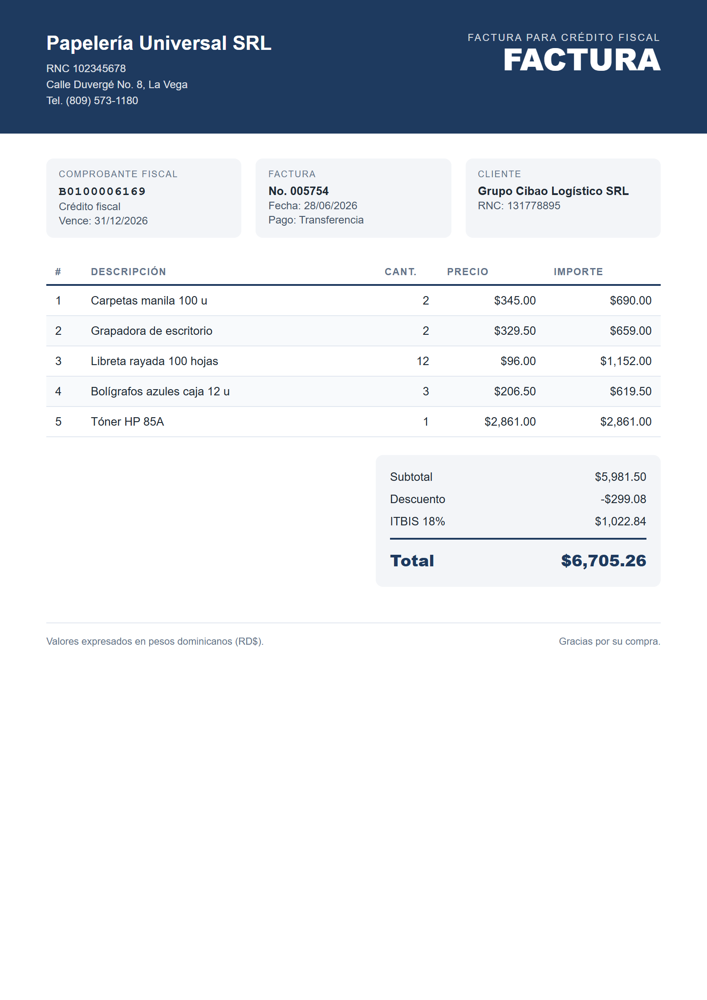
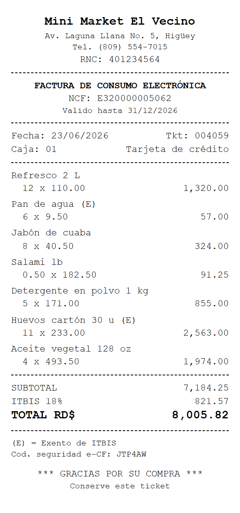

# DR Invoice Extractor

[](https://github.com/wildensnz/dr-invoice-extractor/actions/workflows/ci.yml)

Turn photos and PDFs of **Dominican invoices** into structured JSON with Claude
vision, check them against local business rules (RNC, NCF, ITBIS, totals),
review and fix them in the browser, and measure extraction accuracy with an
eval suite over synthetic invoices.



**Live demo:** _pending Vercel deploy_

## What it does

- Upload a JPEG, PNG, WebP or PDF (≤ 5 MB), or pick one of four synthetic
  samples.
- Claude reads the invoice into a fixed JSON shape: issuer (name, RNC),
  customer, NCF, date, currency, line items, subtotal, discount, ITBIS, total.
- Local rules flag anything suspicious (wrong RNC check digit, malformed NCF,
  ITBIS that is not 18 % of the taxable base, totals that do not add up).
  Rules never change values; a human does.
- The review screen shows the invoice next to the fields. Warnings are amber
  with the reason in a tooltip; editing a line recalculates the totals.
  Download the JSON when it looks right.
- `npm run eval` measures accuracy per field over 30 synthetic invoices in
  three layouts, as PDF and as PNG.

Nothing is stored: files are processed in memory and discarded.

## How extraction works

`POST /api/extract` takes a multipart `file` and returns
`{ invoice, checks, usage }`.

1. The file is sniffed by magic bytes (JPEG, PNG, WebP or PDF) and capped at
   5 MB before anything is sent anywhere. Requests are rate limited per client.
2. `lib/extract.ts` sends the image (`image` block) or PDF (`document` block)
   to Claude with a short system prompt that explains the Dominican context
   (RNC, NCF series, ITBIS 18 %, dd/mm/yyyy dates, RD$).
3. The response is constrained with **structured outputs**:
   `output_config.format` carries the JSON Schema derived from the zod
   `InvoiceSchema`, so the model can only emit a document of that shape. (The
   older trick of forcing `tool_choice` to an extraction tool is rejected by
   current models; structured outputs is its replacement.)
4. The JSON is parsed again with zod on our side. If that fails, the issues are
   sent back to the model for one retry; after that the API answers 422.
5. The validation rules below run on the parsed invoice and the result goes to
   the review UI.

## Validation rules

Every extracted invoice goes through `lib/validate.ts`. Each rule yields `ok`
or `warning` with a reason.

| Field            | Rule                                                                |
| ---------------- | ------------------------------------------------------------------- |
| `issuer.rnc`     | 9-digit RNC with a valid DGII check digit, or 11-digit cédula       |
| `customer.rnc`   | Same; required when the NCF is crédito fiscal (B01 / E31)           |
| `ncf`            | `B` + type + 8 digits or e-CF `E` + type + 10 digits; known type    |
| `date`           | Real calendar date, not in the future                               |
| `items[i].total` | quantity × unit price (± RD$1)                                      |
| `subtotal`       | Σ line totals (± RD$1)                                              |
| `itbis`          | 18 % of the taxable base (exempt lines excluded, discount prorated) |
| `total`          | subtotal − discount + ITBIS (± RD$1)                                |



## Eval results

`npm run eval` extracts all 30 fixtures as PDF and as PNG (60 API calls),
compares each result with the expected JSON and writes
[`evals/report.md`](evals/report.md): accuracy per field (overall, PDF, PNG),
perfect-extraction rate per layout, token cost, and every mismatch with the
expected and extracted values. Exact match for RNC, NCF, date and line count;
± RD$1 for money.

_First run pending. The table from `evals/report.md` will be copied here._

Options: `--format pdf|png`, `--ids 0001,0002`, `--limit N`,
`--concurrency N`, `--model <id>`. It needs `ANTHROPIC_API_KEY` and never runs
in CI.

## Synthetic fixtures

`npm run fixtures` renders 30 invented invoices in three layouts (formal A4,
modern A4, 80 mm thermal ticket) to `fixtures/invoices/NNNN.{pdf,png,json}`
with Playwright. Data is seeded, so the output is byte-for-byte reproducible.
They cover B01/B02/B14/B15 and e-CF (E31/E32), ITBIS-exempt lines, discounts,
customers with RNC, cédula or none, and tax ids printed with and without
dashes. Nothing in them is real: names, RNCs (valid check digits, assigned to
nobody), addresses and prices are all invented.

| Formal A4                       | Modern A4                       | Thermal ticket                  |
| ------------------------------- | ------------------------------- | ------------------------------- |
|  |  |  |

## Run locally

```bash
git clone https://github.com/wildensnz/dr-invoice-extractor
cd dr-invoice-extractor
npm install
cp .env.example .env.local   # add your ANTHROPIC_API_KEY
npm run dev
```

| Script             | What it does                                                                             |
| ------------------ | ---------------------------------------------------------------------------------------- |
| `npm run dev`      | Next.js dev server on http://localhost:3000                                              |
| `npm run check`    | typecheck + lint + format check + unit tests (runs in CI)                                |
| `npm run fixtures` | regenerate the 30 synthetic invoices (needs Chromium: `npx playwright install chromium`) |
| `npm run eval`     | extract every fixture and write `evals/report.md` (costs tokens)                         |

Environment: `ANTHROPIC_API_KEY` (required), `ANTHROPIC_MODEL` (optional,
default `claude-sonnet-5-5`).

## Deploy

The app is a standard Next.js project. On Vercel: import the repository, add
`ANTHROPIC_API_KEY` as an environment variable, deploy. The extraction route
sets `maxDuration = 60`.

## Project structure

```
app/
  page.tsx                 single page
  api/extract/route.ts     POST multipart -> { invoice, checks, usage }
components/
  upload-dropzone.tsx      drag & drop + samples
  invoice-preview.tsx      image with zoom / PDF viewer
  review-form.tsx          fields, warnings, line items, totals
  line-items-table.tsx, field.tsx, invoice-extractor.tsx
  ui/                      shadcn/ui
lib/
  schema.ts                zod Invoice + JSON schema for structured outputs
  extract.ts               Claude call, zod re-parse, one retry
  validate.ts              Dominican business rules -> checks[]
  files.ts, rate-limit.ts, recalc.ts, format.ts, examples.ts
fixtures/
  data.ts                  seeded synthetic invoice data
  templates/               classic.html, modern.html, thermal.html
  generate.ts              renders pdf + png + json with Playwright
  invoices/                30 x (pdf, png, json), committed
evals/
  compare.ts               field comparison + report rendering
  run.ts                   npm run eval
  report.md                last run
tests/                     vitest unit tests
```

## Limits

- Single-page invoices only. Multi-page PDFs are sent whole but the schema
  describes one invoice.
- The rate limiter lives in process memory, so on serverless the real limit is
  per instance.
- Restaurant invoices with the legal 10 % service charge (propina legal) are
  not modelled; the total rule will flag them.
- The eval uses synthetic invoices rendered from HTML. Real photos (skew, glare,
  low light) are harder; treat the numbers as an upper bound.

## Stack

Next.js (App Router) · TypeScript · Tailwind v4 · shadcn/ui ·
`@anthropic-ai/sdk` · zod · Vitest · Playwright (fixture generation only).
